# Intro

This project, developed as a part of my MSc thesis, aims to process and organize personal data generated from multiple web platforms. We propose two resulting data structures:
- A MongoDB database
- A Knowledge Graph (with NetworkX and Neo4j support)

The currently supported platforms are the following:
- Google Search
- YouTube
- Facebook
- Twitter
- Reddit

# Requirements

**To Use** this project on your own data, you must download your personal files from each platform and save them in the ```data/``` directory with the appropriate name. 

High-level parameters are specified in the main configuration file in ```configs/main.yaml```. There is one aditional configuration file for platform that helps determine how its files are processed.  
 
The available functions and its respecitve are as follows:
 
### Initial Processing

```python src/initialProcessing/initialPipeline.py```
 
Tasks:   
- Process the files from each platform into two MongoDB collections reggarding pieces of content and sources of content.
- Perform entity extraction on the bodys of content objects (requires [Rosette Analytics](https://developer.rosette.com/) key).
- Create a Tag collection in MongoDB for each tag collected.
- Tranform the processed data into a network containing the following object types: Days, Content, Sources, Tags.

### Basic Analysis
 (requires **Initial Processing**)

```python src/analysis/analysisPipeline.py``` 

Tasks:   
- Plot your activity per platform and content type (Example in [Fig X]() and [Fig X]())
- Plot the object type count in the resulting network (Example in [Fig X]())
- Plot the centrality distribution of each object type (several centrality measures can be select but beware of long execution times) (Example in [Fig X]())

### Roam/Obsidian export

```python src/initialProcessing/roamExport.py``` 

### Calendar Heatmap for specific entities

```raise notImplemented()``` 

# Processing into MongoDB

## Content Collection
Most personal data files have a structure focused on user actions and content.Some standardization is required in order to accommodate data from different platforms. 

We convert every file into a list of objects. Each object represents a piece of content that's present in the user's history. The following attributes are mandatory but others can be added to the database as well.

```python
{
    platform: str,
    timestamp: [],    # List fo timestamps occurances in the user's history
    type: str,        # Content type
    body: str,        # Payload. Partial observation of the piece of content
    ...
}
```

You may also personalize, in each platform's config file, which keys are vital in defining each content type for each platform. This is usefull to to identify similiar pieces of content across the user's history. (example)

## Source Collection
Online content can usually be traced back to a source - the entity responsible for either creating or distributing said content. Note that these are not bounded to other social media users, they can be web forum where content gets shared like a subreddit or a facebook group. We also create a collection for Sources on the web, each one with the following format.

```python
{
    label:
    type:
    platform:                     # Each source is from a specific platform
    associatedContentTypes:       # Unique content types to which is connected
    associatedContent:            # A list of tuples each including the _id of the piece of content, and this source's relationship type to it
}
```

## Tag Collection
Finally, to provide conceptual context to content objects, we offer the possibility of performing entity extraction on content payloads to create a tag collection. Each tag, which is just an extracted entity, can be associated with different contents. For this, we use the NLP API [Rosette Analytics](https://developer.rosette.com/). Each tag ends up with the following format:
```python
{
	associatedContent: []
	mentionForms: []
	normalizedForms: []
	types:
	QID:      # ID from wikidata
} 
```

# Graph conversion

Previously we defined three types of objects: content, sources, and tags.  In order to accommodate the temporal aspect we introduce a 4th type of object: time, each one representing a day in the user's life. We can now transform the user's history into a network using the validating schema that describes the interactions between these object types. 

<p align="center">
  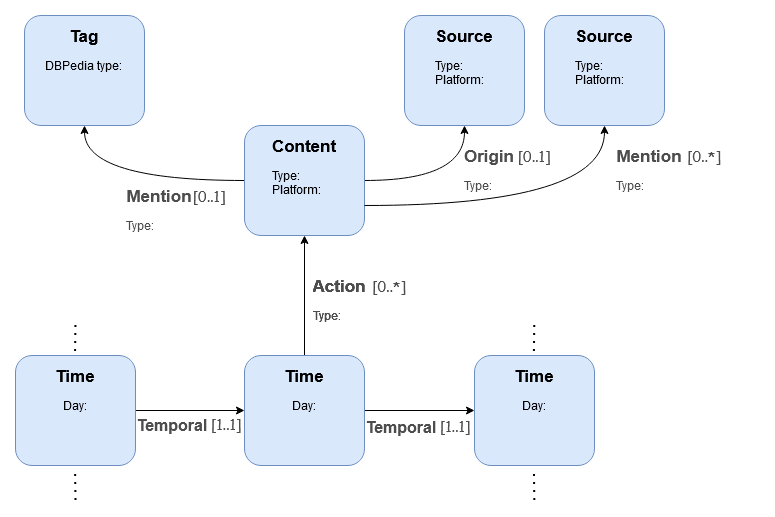
  <figcaption>Fig 1. </figcaption>
</p>  

Each object type is represented by a shape, and the interactions between them as connections between those shapes. Each box (rectangle) represents a shape that is bounded by a set of constraints. Nodes conform to a shape if and only if they satisfy all constraints. 
There are two types of constraints: 
- The existence of certain attributes within a shape 
- Or a connection and number of nodes conforming to a particular shape that the conforming node can relate to via a given edge. For example:
    - [0..1] denotes either no connection or precisely one
    - [1..*] denotes one-to-many
    - [1..1] denotes precisely one

So making a summary of the procedure: We create a chain of time nodes, one for each day in the user's life. These days may connect to content nodes via an action edge. This represents the interaction between the user and a piece of content on a given day. In order to provide context to each content we may connect to tags and sources. Each piece of content can only have one orign connection to a source node but it may mention any number of tags or other sources.  


In order to further to improve the descriptive power of the network, we define a hierarchy of terms for each object class. These will serve as the terminology  of the network, providing semantic value to the connections in it and allowing us to study more complex dynamics. The __type__ attributes in each node or edge hold the values of a **leaf** in the respective hierarchy (Figs 2 and 3).

<p align="center">
  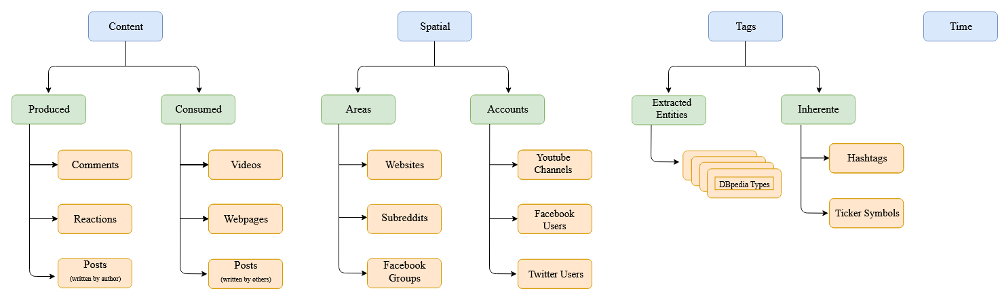
  <figcaption>Fig 2. </figcaption>
</p>  


<p align="center">
  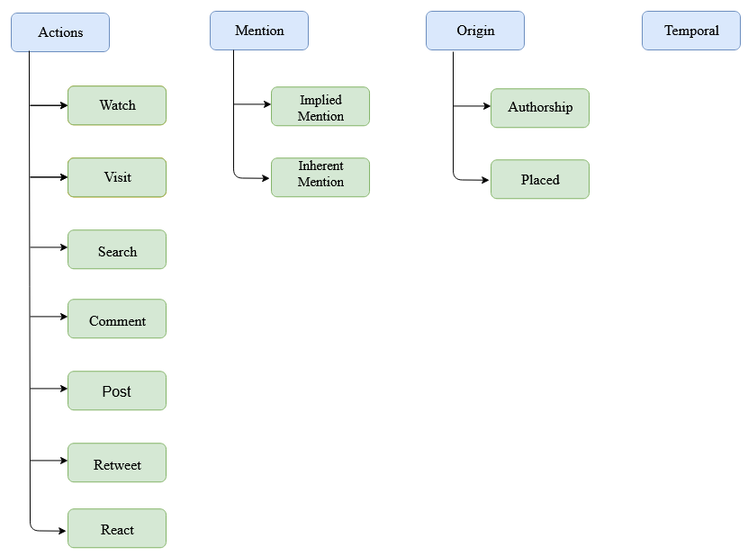
  <figcaption>Fig 3. </figcaption>
</p>  

The resulting network is a heterogeneous graph, guaranteed to have a single component due to the chain of daily nodes.

# Plot Gallery

<p align="center">
  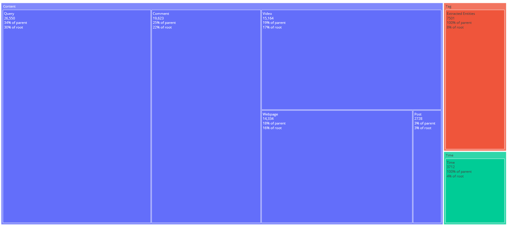
  <figcaption>Fig 4. Count of object types for all hierarchical levels.</figcaption>
</p>  

<p align="center">
  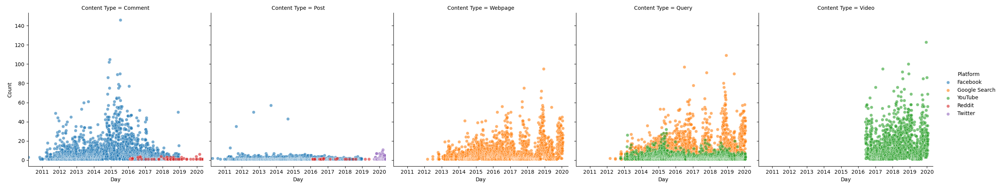
  <figcaption>Fig 5. Temporal distribution of content conception, highlighting the respective platforms.</figcaption>
</p>  

<p align="center">
  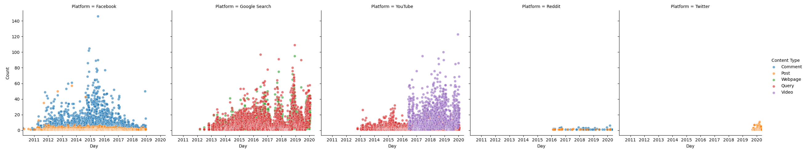
  <figcaption>Fig 6.Temporal distribution of platforms usage, highlighting the content types. </figcaption>
</p>  

<p align="center">
  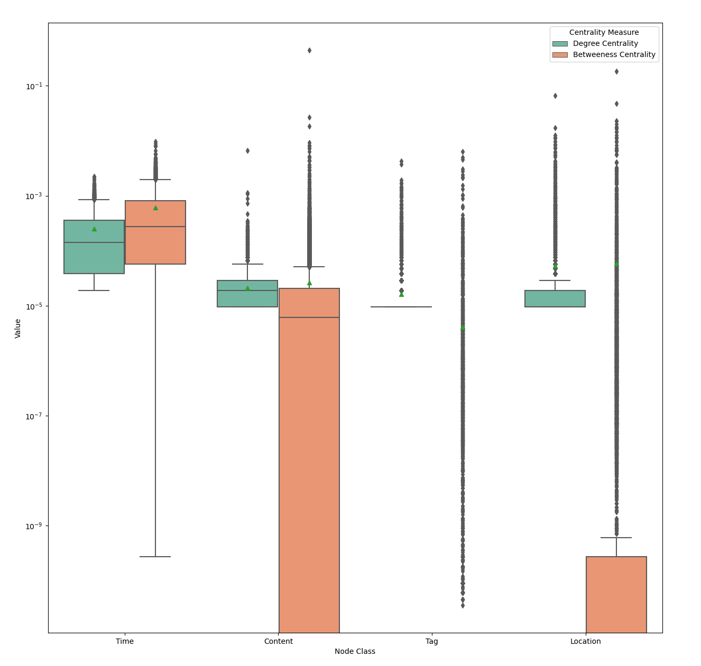
  <figcaption>Fig 7. - Variance of centrality values for each object type in the network.</figcaption>
</p>  

<p align="center">
  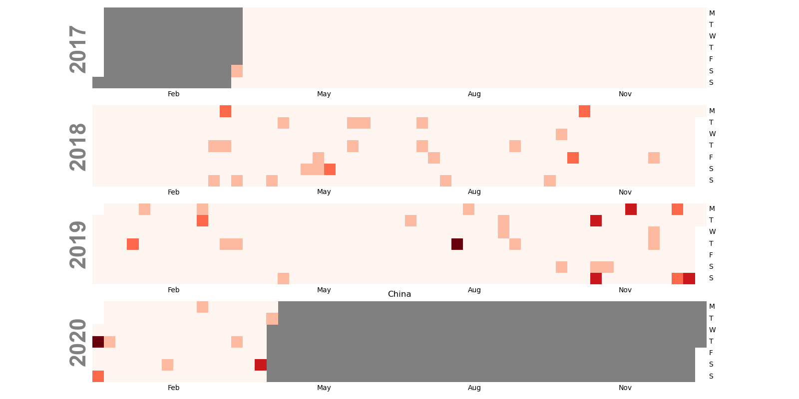
  <figcaption>Fig 8. - Calendar HeatMap of the China Tag.</figcaption>
</p>  

<p align="center">
  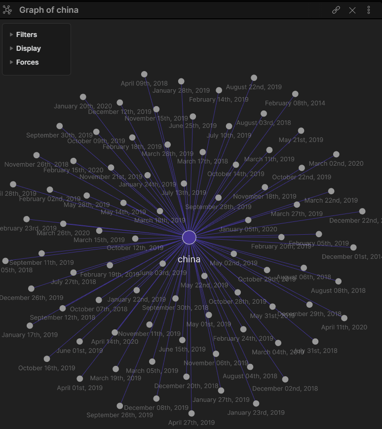
  <figcaption>Fig 9.- Obsidian. China Tag local map.</figcaption>
</p>  

<p align="center">
  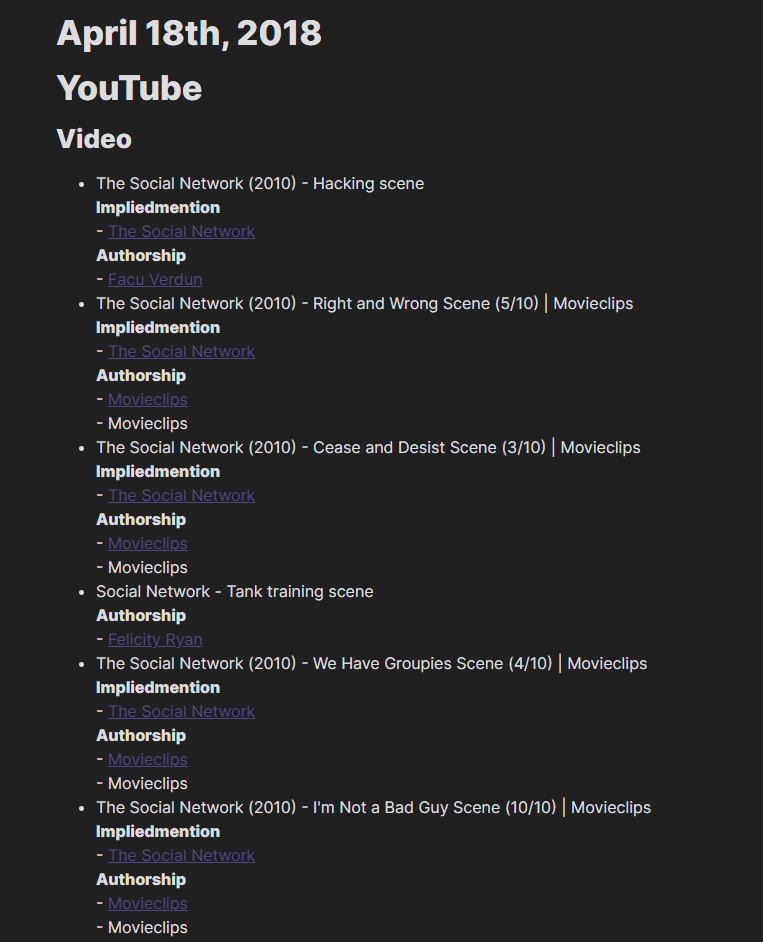
  <figcaption>Fig 10. - Obsidian. Example of a day page</figcaption>
</p>
  
<p align="center">
  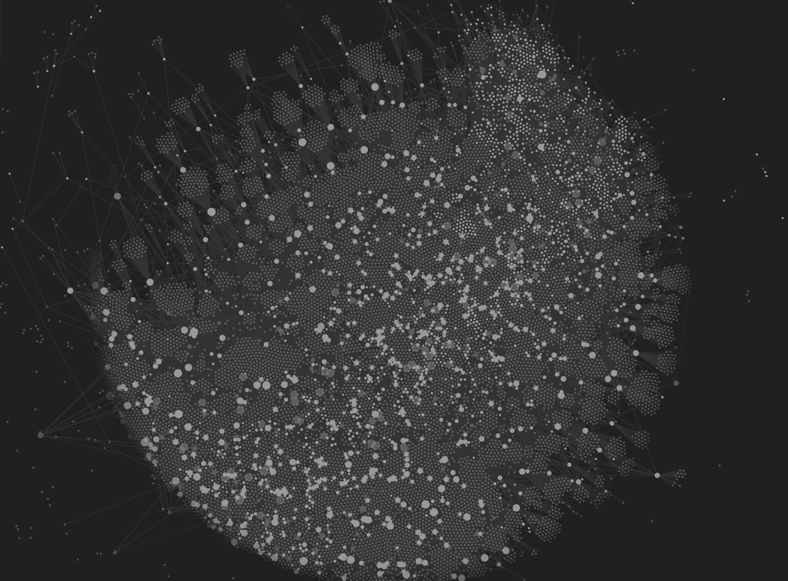
  <figcaption>Fig 11. - Obsidian. Full Personal Graph.</figcaption>
</p>  

