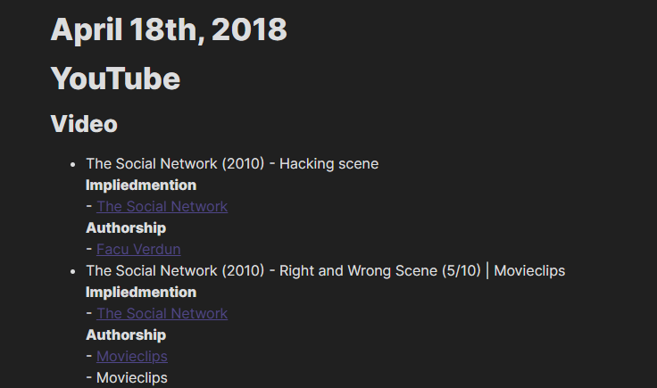

# Intro

This project, developed as a part of my MSc thesis, aims to process and organize personal data generated from multiple web platforms. We propose two resulting data structures:
- A MongoDB database
- A Knowledge Graph (with NetworkX and Neo4j support)

The currently supported platforms are the following:
- Google Search
- YouTube
- Facebook
- Twitter
- Reddit

# Requirements

**To Use** this project on your own data, you must download your personal files from each platform and save them in the ```data/``` directory with the appropriate name. You may read more on this in the [guide on downloading your personal files](https://github.com/andre-cavalheiro/Digital-Me/tree/main/docs/guides/downloadingPersonalData.md).

The main configuration file is in ```configs/main.yaml```. You may read more on how to configure the pipeline [here](https://github.com/andre-cavalheiro/Digital-Me/tree/main/docs/guides/configDocs.md). There is one additional config file for each platform.
 
To simplify this project's usage, I have created several pipelines, each one composed of several scripts. You may choose only to run a specific step by running the respective script. Nonetheless, you must start by running the *initialPipeline* which is required for further operations.

The pipelines are as follows: 
 
### Initial Processing

```python src/initialProcessing/initialPipeline.py```
 
Tasks:   
- Process the files from each platform into two MongoDB collections reggarding pieces of content and sources of content.
- Perform entity extraction on the bodys of content objects (requires [Rosette Analytics](https://developer.rosette.com/) key).
- Create a Tag collection in MongoDB for each tag collected.
- Tranform the processed data into a network containing the following object types: Days, Content, Sources, Tags.

### Basic Analysis

```python src/analysis/analysisPipeline.py``` 

Tasks:   
- Plot the object type count in the resulting network (Example in Fig 4. [here](#analysis))
- Plot your activity per platform and content type (Example in Fig. 5 and Fig 6 [here](#analysis))
- Plot the centrality distribution of each object type (several centrality measures can be select but beware of long execution times) (Example in Fig 7 [here](#analysis))


### Roam/Obsidian export

```python src/exports/obsidian.py``` 

# Processing into MongoDB

## Content Collection
Most personal data files have a structure focused on user actions and content.Some standardization is required in order to accommodate data from different platforms. 

We convert every file into a list of objects. Each object represents a piece of content that's present in the user's history. The following attributes are mandatory but others can be added to the database as well.

```python
{
    platform: str,
    timestamp: [],    # List fo timestamps occurances in the user's history
    type: str,        # Content type
    body: str,        # Payload. Partial observation of the piece of content
    ...
}
```

You may also personalize, in each platform's config file, which keys are vital in defining each content type for each platform. This is usefull to to identify similiar pieces of content across the user's history. (example)

## Source Collection
Online content can usually be traced back to a source - the entity responsible for either creating or distributing said content. Note that these are not bounded to other social media users, they can be web forum where content gets shared like a subreddit or a facebook group. We also create a collection for Sources on the web, each one with the following format.

```python
{
    label:
    type:
    platform:                     # Each source is from a specific platform
    associatedContentTypes:       # Unique content types to which is connected
    associatedContent:            # A list of tuples each including the _id of the piece of content, and this source's relationship type to it
}
```

## Tag Collection
Finally, to provide conceptual context to content objects, we offer the possibility of performing entity extraction on content payloads to create a tag collection. Each tag, which is just an extracted entity, can be associated with different contents. For this, we use the NLP API [Rosette Analytics](https://developer.rosette.com/). Each tag ends up with the following format:
```python
{
	associatedContent: []
	mentionForms: []
	normalizedForms: []
	types:
	QID:      # ID from wikidata
} 
```

# Graph conversion

Previously we defined three types of objects: content, sources, and tags.  In order to accommodate the temporal aspect we introduce a 4th type of object: time - that represents a day in the user's life. We can now transform the user's history into a network using the validating schema bellow which describes how these object interact. 

<p align="center">
  
  <br>
  <em>Fig 1. - Network's validating schema.</em>
</p>  

Fig 1 can be described as follows. A shape (box) represents each object type. Connections between those shapes represent interactions between object types. Shapes are bounded by constraints. Nodes conform to a shape if and only if they satisfy all constraints. 
There are two types of constraints: 
- The existence of specific attributes. 
- The number of nodes conforming to a particular shape that the node in question can relate to via a specific edge type. For example:
    - [0..1] denotes either no connection or precisely one
    - [1..*] denotes one-to-many
    - [1..1] denotes precisely one

Summarizing in text the validating schema of Fig 1: We create a chain of time nodes, one for each day in the user's life. These days may connect to content nodes via an action edge. This represents the interaction between the user and a piece of content on a given day. To provide context to each content, we may connect it to tags and sources. Each piece of content can only have one origin connection to a source node. Still, it may mention any number of tags or other sources.  

In order to further to improve the descriptive power of the network, we define a hierarchy of terms for each object class. These will serve as the terminology, providing semantic value and allowing us to study more complex dynamics. The __type__ attributes in each node/edge holds the value of a **leaf** in the respective hierarchy (Figs 2/3).

<p align="center">
  
  <br>
  <em>Fig 2. - Network's semantic schema for nodes.</em>
</p>  

<p align="center">
  
  <br>
  <em>Fig 3. - Network's semantic schema for edges.</em>
</p>  

The resulting network is a heterogeneous graph, guaranteed to have a single component due to the chain of daily nodes.

# Analysis
(#analysis)

<p align="center">
  
  <br>
  <em>Fig 4. - Count of object types for all semantic levels.</em>
</p>  

<p align="center">
  
  <br>
  <em>Fig 5. - Temporal distribution of content conception, highlighting the respective platforms.</em>
</p>  

<p align="center">
  
  <br>
  <em>Fig 6. - Temporal distribution of platform usage, highlighting the content types.</em>
</p>  

<p align="center">
  
  <br>
  <em>Fig 7. - Variance of centrality values for each object type in the network.</em>
</p>  

<p align="center">
  
  <br>
  <em>Fig 8. - Calendar HeatMap for the "China" Tag.</em>
</p>  

# Obsidian Export

<p align="center">
  
  <br>
  <em>Fig 10. - Day page in Obsidian </em>
</p>

<p align="center">
  
  <br>
  <em>Fig 9.- Obsidian local graph for the "China" Tag.</em>
</p>  

<p align="center">
  
  <br>
  <em>Fig 10. - Obsidian full network graph.</em>
</p>  


  

